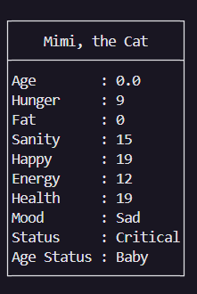
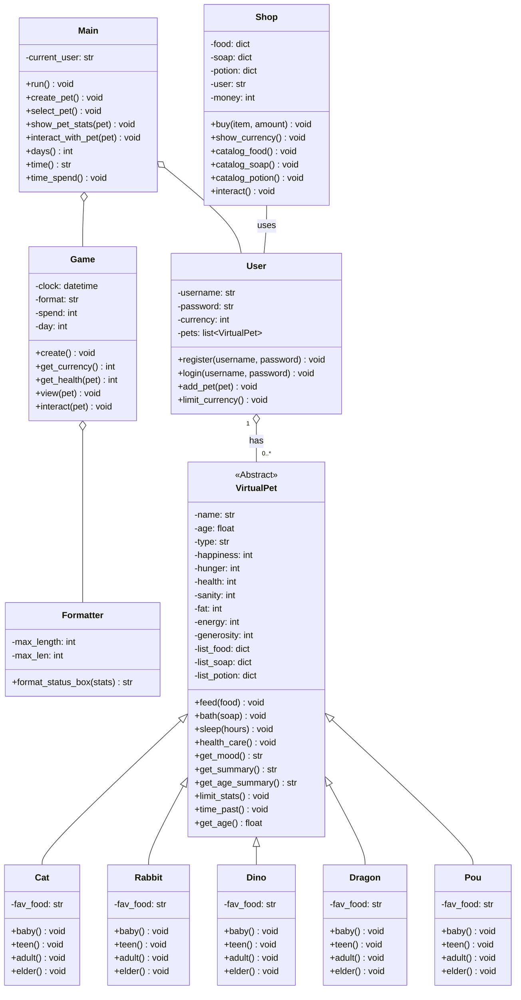

English | [Indonesian](READMEID.md) | [中文](READMECN.md)
# 🐾 Virtual Pet Game


A captivating, console-based virtual pet simulation game built with Object-Oriented Programming in Python. Choose a pet, give it a name, and take on the responsibility of raising it from a tiny baby to a wise elder. Manage its stats, play with it, and keep it healthy and happy!

---

## 🎮 Gameplay Demo

The entire game runs in your terminal, featuring detailed status boxes and charming ASCII art for each pet's life stage.

**Create your own unique pet:**
```
───────────────────────────────── Create Your Own Pet ─────────────────────────────────────────
Name your pet: Mochi
─────────────────────────────────────────────────────────────────────────────────────────────────
Here's five types of species you can choose:
1. Cat
2. Rabbit
3. Dinosaur
4. Dragon
5. Pou
─────────────────────────────────────────────────────────────────────────────────────────────────
Choose his/her species (input type of species here): cat

─────────────────────────────────────────────────────────────────────────────────────────────────
Mochi, a cat, has born!
─────────────────────────────────────────────────────────────────────────────────────────────────
```

**Watch it grow and see its unique art for each life stage:**
```
==================================================================================================

/|、      ......
(˚ˎ 。7  . miw! .
 |、˜〵   ......
じしˍ,)ノ
~~~~~~~~~~~~~~~

```

**Keep track of its needs with a detailed status panel:**



---

## ✨ Core Features

-   **Diverse & Evolving Pets**: Choose from 5 unique species: **Cat, Rabbit, Dinosaur, Dragon, and Pou**. Watch your pet grow through four distinct life stages (Baby, Teen, Adult, Elder), each with its own beautifully crafted ASCII art.
-   **Deep Pet Simulation**: Manage a complex set of stats including **Hunger, Sanity, Happiness, Health, Fat, and Energy**. Each stat affects your pet's mood and overall well-being. Neglecting their needs can lead to critical health!
-   **Interactive Care System**: Engage with your pet through a variety of actions:
    -   **Feed**: Choose from a menu of foods with different effects.
    -   **Bathe**: Keep your pet clean and sane with different soaps.
    -   **Play**: Increase happiness with species-specific activities.
    -   **Talk**: Interact with your pet to hear their thoughts or even get a joke!
    -   **Walk**: Take your pet for a walk, but beware of random events that could be good or bad!
    -   **Sleep**: Restore your pet's energy.
-   **In-Game Economy & Shop**: Earn in-game currency by playing with your pet. Spend it at the Pet Shop on a variety of foods, soaps, and powerful potions like the "Fat Burner" or "Adult Potion".
-   **User Authentication**: A secure user system allows players to register, log in, and change their passwords, with validation rules to ensure strong credentials.
-   **Time System**: The game tracks time passing with an in-game clock and day counter, and your pet's stats will passively change over time, requiring constant care.

---

## 🛠️ Technical Showcase

This project is a practical demonstration of key Object-Oriented Programming principles:
-   **Object-Oriented Programming (OOP)**: The entire project is built around classes like `VirtualPet`, `User`, `Game`, and `Shop`, creating a logical and scalable structure.
-   **Inheritance & Polymorphism**: Each animal (`Cat`, `Rabbit`, etc.) inherits from the base `VirtualPet` class. They share common methods (`feed`, `bath`) but have unique properties (like favorite food) and unique ASCII art displays (polymorphism).
-   **Class Methods & Properties**: The `User` class utilizes `@classmethod` for registration/login and `@property` for secure password and currency handling.
-   **Data Encapsulation**: Key attributes in classes like `User` are encapsulated to protect data integrity.
-   **Modular Design**: The code is cleanly separated into different files (`user.py`, `pet.py`, `game.py`, etc.), each with a single responsibility, making the project easy to maintain and understand.

---

## 🏛️ Architecture & Class Diagram

The game's architecture is centered around the `VirtualPet` base class, with specialized animal classes inheriting from it. The `Main` class orchestrates the game flow, utilizing `User`, `Game`, and `Shop` objects to manage the overall experience.



---

## 🚀 Getting Started

No special libraries are needed to run this game, just a standard Python installation.

### Prerequisites
- Python 3.x

### Installation & Running
1.  Clone or download the repository.
    ```bash
    git clone [https://github.com/Jess2Jes/Virtual-Pet-Game.git](https://github.com/Jess2Jes/Virtual-Pet-Game.git)
    cd Virtual-Pet-Game
    ```
2.  Run the `main.py` file from your terminal.
    ```bash
    python main.py
    ```
3.  Follow the on-screen instructions to register a user and start playing!

---
## 📂 Project Structure
- `main.py` – The main entry point, handles menus and game state.
- `game.py` – Manages the core gameplay loop and pet interactions.
- `pet.py` – Defines the base `VirtualPet` class, stats, and core logic.
- `animal.py` – Contains the specific animal subclasses with their unique ASCII art.
- `formatter.py` – A utility class to create the formatted status box UI.
- `shop.py` – Contains the `Shop` class, item catalogs, and purchase logic.
- `user.py` – Handles user registration, authentication, currency, and pet ownership.

---
## 🗺️ Roadmap

-   **Persistence**: Save/load game state for users and their pets (using JSON, pickle, or a database).
-   **GUI Implementation**: Port the game to a graphical interface using a library like Tkinter or PyQT.
-   **More Content**: Add more animal types, items, and random events.
-   **Mini-Games**: Introduce interactive mini-games to earn currency and boost stats.
-   **Testing**: Implement unit tests to ensure code quality and prevent bugs.

---
## 👥 Author & Contributors

<table border="0" cellspacing="10" cellpadding="5">
  <tr>
    <td align="center" style="border: 1px solid #555; padding: 10px;">
      <a href="https://github.com/Jess2Jes">
        
      </a>
      <br/>
      <a href="https://github.com/Jess2Jes">Jess2Jes</a>
    </td>
    <td align="center" style="border: 1px solid #555; padding: 10px;">
      <a href="https://github.com/Dendroculus">
        
      </a>
      <br/>
      <a href="https://github.com/Dendroculus">Hans</a>
    </td>
    <td align="center" style="border: 1px solid #555; padding: 10px;">
      <a href="https://github.com/StevNard">
        
      </a>
      <br/>
      <a href="https://github.com/StevNard">StevNard</a>
    </td>
  </tr>
</table>
