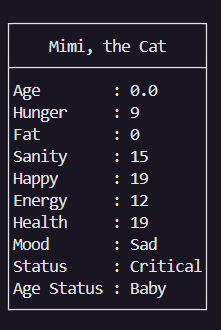

<div align="center">

English | [Indonesian](READMEID.md) | [中文](READMECN.md)

</div>

<div align="center">

# 🐾 Virtual Pet Game

</div>

<p align="center">
  
  
  
  
</p>

A console-based virtual pet simulation game built with Object-Oriented Programming (OOP) in Python. Choose a pet, name it, and take care of it as it grows through multiple life stages. Manage stats, play with it, and keep it healthy and happy.

---

## 🎮 Gameplay Demo

The entire game runs in your terminal, featuring detailed status boxes and ASCII art for each pet’s life stage.

**Create your own unique pet:**
```text
───────────────────────────────── Create Your Own Pet ─────────────────────────────────────────
Name your pet: Mochi
─────────────────────────────────────────────────────────────────────────────────────────────────
Here's five types of species you can choose:
1. Cat
2. Rabbit
3. Dinosaur
4. Dragon
5. Pou
─────────────────────────────────────────────────────────────────────────────────────────────────
Choose his/her species (input type of species here): cat

─────────────────────────────────────────────────────────────────────────────────────────────────
Mochi, a cat, has born!
─────────────────────────────────────────────────────────────────────────────────────────────────
```

**Watch it grow and see its unique art for each life stage:**
```text
==================================================================================================

/|、      ......
(˚ˎ 。7  . miw! .
 |、˜〵   ......
じしˍ,)ノ
~~~~~~~~~~~~~~~
```

**Keep track of its needs with a detailed status panel:**



---

## ✨ Core Features

- **Diverse & Evolving Pets**: Choose from 5 species (**Cat, Rabbit, Dinosaur, Dragon, Pou**) and watch them grow through life stages (**Baby, Teen, Adult, Elder**) with unique ASCII art.
- **Deep Pet Simulation**: Manage stats like **Hunger, Sanity, Happiness, Health, Fat, Energy**. Neglect can lead to critical conditions.
- **Interactive Care Actions**:
  - **Feed**, **Bathe**, **Play**, **Talk**, **Walk**, **Sleep**
- **In-Game Economy & Shop**: Earn currency and buy foods, soaps, and special potions.
- **User Authentication**: Register, log in, and change passwords with validation.
- **Time System**: In-game time/day system with passive stat changes.

---

## 🛠️ Technical Showcase

- **OOP Design**: Built around core modules (`game`, `pet`, `user`, `shop`).
- **Inheritance & Polymorphism**: Species classes inherit from a base pet model and implement unique behaviors/art.
- **Modular Codebase**: Features and utilities are separated into focused files and folders.

---

## 🚀 Getting Started

### Prerequisites
- Python 3.x

### Installation & Running
1. Clone the repo
```bash
git clone https://github.com/Jess2Jes/Virtual-Pet-Game.git
cd Virtual-Pet-Game
```

2. Run the game
```bash
python main.py
```

3. Follow the prompts to register and start playing.

---

## 📂 Project Structure

```bash
Virtual-Pet-Game/
├── assets/
│   └── pet_stats.png
├── constants/
│   ├── arts/
│   │   ├── cat.py
│   │   ├── dino.py
│   │   ├── dragon.py
│   │   ├── pou.py
│   │   ├── rabbits.py
│   │   └── animalsArt.py
│   └── configs.py
├── datas/
│   ├── conversations.json
│   ├── jokes.json
│   └── words.txt
├── docs/
├── features/
│   ├── minigame/
│   ├── animal.py
│   ├── game.py
│   ├── memento.py
│   ├── pet.py
│   ├── save_manager.py
│   ├── shop.py
│   └── user.py
├── program_testing/
├── saves/
│   └── player_saves.json
├── utils/
├── main.py
├── README.md
├── READMEID.md
├── READMECN.md
└── LICENSE
```

> Folder/filename notes:
> - `constants/arts/` contains species ASCII art modules.
> - `datas/` contains game text content (conversations, jokes, words).
> - `features/` contains the main game logic modules.

---

## 🗺️ Roadmap

- **Persistence**: Improve save/load system (or migrate to SQLite).
- **GUI Implementation**: Build a graphical version (Tkinter / PyQT).
- **More Content**: More species, items, and random events.
- **Mini-Games**: Expand mini-games and rewards.
- **Testing**: Add unit tests and CI.

---

## 👥 Author & Contributors

<table border="0" cellspacing="10" cellpadding="5">
  <tr>
    <td align="center" style="border: 1px solid #555; padding: 10px;">
      <a href="https://github.com/Jess2Jes">
        
      </a>
      <br/>
      <a href="https://github.com/Jess2Jes">Jessica Gunawan</a>
    </td>
    <td align="center" style="border: 1px solid #555; padding: 10px;">
      <a href="https://github.com/Yoruxyv">
        
      </a>
      <br/>
      <a href="https://github.com/Yoruxyv">Hans Valerie</a>
    </td>
    <td align="center" style="border: 1px solid #555; padding: 10px;">
      <a href="https://github.com/StevNard">
        
      </a>
      <br/>
      <a href="https://github.com/StevNard">Steven Lienardi</a>
    </td>
  </tr>
</table>

---

## 📜 License

This project is licensed under the MIT License. See [`LICENSE`](LICENSE) for details.