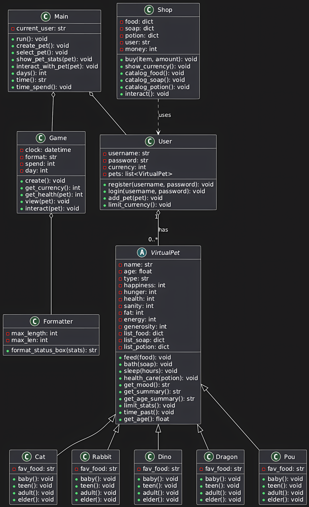

[English](README.md) | [Indonesian](READMEID.md) | 中文
# 🐾 虚拟宠物游戏


一款引人入胜、基于控制台的虚拟宠物模拟游戏，使用 Python 的面向对象编程思想构建。选择一只宠物，给它起个名字，并承担起将它从一个嗷嗷待哺的婴儿抚养成一位智慧长者的责任。管理它的状态，与它玩耍，让它保持健康和快乐！

---

## 🎮 游戏玩法演示

整个游戏在您的终端中运行，为每个宠物的不同生命阶段提供详细的状态框和迷人的 ASCII 艺术。

**创建你自己的独特宠物：**
```
───────────────────────────────── Create Your Own Pet ─────────────────────────────────────────
Name your pet: Mochi
─────────────────────────────────────────────────────────────────────────────────────────────────
Here's five types of species you can choose:
1. Cat
2. Rabbit
3. Dinosaur
4. Dragon
5. Pou
─────────────────────────────────────────────────────────────────────────────────────────────────
Choose his/her species (input type of species here): cat

─────────────────────────────────────────────────────────────────────────────────────────────────
Mochi, a cat, has born!
─────────────────────────────────────────────────────────────────────────────────────────────────
```

**看着它成长，并欣赏每个生命阶段独特的艺术风格：**
```
==================================================================================================

/|、      ......
(˚ˎ 。7  . miw! .
 |、˜〵   ......
じしˍ,)ノ
~~~~~~~~~~~~~~~

```

**通过详细的状态面板跟踪它的需求：**


---

## ✨ 核心功能

-   **多样化且不断进化的宠物**: 从5个独特的物种中选择：**猫、兔子、恐龙、龙和Pou**。看着你的宠物经历四个不同的生命阶段（婴儿、青少年、成年、老年），每个阶段都有精心制作的 ASCII 艺术。
-   **深度宠物模拟**: 管理一套复杂的状态属性，包括**饥饿度、理智值、快乐度、健康值、肥胖度和精力值**。每个属性都会影响宠物的心情和整体健康状况。忽视它们的需求可能会导致生命危险！
-   **互动式照料系统**: 通过各种行动与您的宠物互动：
    -   **喂食**: 从具有不同效果的食物菜单中选择。
    -   **洗澡**: 用不同的肥皂保持宠物的清洁和理智。
    -   **玩耍**: 通过物种特定的活动来增加快乐度。
    -   **交谈**: 与您的宠物互动，听听它的想法，甚至还能听到一个笑话！
    -   **散步**: 带你的宠物去散步，但要小心可能发生的好或坏的随机事件！
    -   **睡觉**: 恢复宠物的精力。
-   **游戏内经济与商店**: 通过与宠物玩耍来赚取游戏货币。在宠物商店里消费，购买各种食物、肥皂和强大的药水，如“燃脂剂”或“成年药水”。
-   **用户认证系统**: 一个安全的用户系统，允许玩家注册、登录和更改密码，并有验证规则以确保强大的凭证。
-   **时间系统**: 游戏通过游戏内的时钟和天数计数器来追踪时间的流逝，宠物的状态会随着时间的推移而被动改变，需要持续的照顾。

---

## 🛠️ 技术展示

该项目是关键的面向对象编程原则的实践展示：
-   **面向对象编程 (OOP)**: 整个项目围绕 `VirtualPet`、`User`、`Game` 和 `Shop` 等类构建，创建了一个逻辑清晰且可扩展的结构。
-   **继承与多态**: 每种动物（`Cat`、`Rabbit` 等）都继承自基础的 `VirtualPet` 类。它们共享通用方法（`feed`、`bath`），但具有独特的属性（如最喜欢的食物）和独特的 ASCII 艺术显示（多态性）。
-   **类方法与属性**: `User` 类利用 `@classmethod` 进行注册/登录，并使用 `@property` 进行安全的密码和货币处理。
-   **数据封装**: `User` 等类中的关键属性被封装起来，以保护数据的完整性。
-   **模块化设计**: 代码被清晰地分离到不同的文件中（`user.py`、`pet.py`、`game.py` 等），每个文件都有单一的职责，使得项目易于维护和理解。

---

## 🏛️ 架构与类图

该游戏的架构以 `VirtualPet` 基类为中心，专门的动物类继承自它。 `Main` 类负责协调游戏流程，利用 `User`、`Game` 和 `Shop` 对象来管理整体体验。



## 🚀 开始使用

运行此游戏不需要特殊库，只需要标准的 Python 安装。

### 先决条件
- Python 3.x

### 安装与运行
1.  克隆或下载仓库。
    ```bash
    git clone [https://github.com/Jess2Jes/Virtual-Pet-Game.git](https://github.com/Jess2Jes/Virtual-Pet-Game.git)
    cd Virtual-Pet-Game
    ```
2.  从您的终端运行 `main.py` 文件。
    ```bash
    python main.py
    ```
3.  按照屏幕上的说明注册用户并开始游戏！

---
## 📂 项目结构
- `main.py` – 主入口点，处理菜单和游戏状态。
- `game.py` – 管理核心游戏循环和宠物互动。
- `pet.py` – 定义基础的 `VirtualPet` 类、状态和核心逻辑。
- `animal.py` – 包含特定的动物子类及其独特的 ASCII 艺术。
- `formatter.py` – 一个用于创建格式化状态框 UI 的工具类。
- `shop.py` – 包含 `Shop` 类、物品目录和购买逻辑。
- `user.py` – 处理用户注册、认证、货币和宠物所有权。

---
## 🗺️ 发展蓝图

-   **持久化**: 为用户及其宠物保存/加载游戏状态（使用 JSON、pickle 或数据库）。
-   **GUI 实现**: 使用像 Tkinter 或 PyQT 这样的库将游戏移植到图形界面。
-   **更多内容**: 添加更多动物类型、物品和随机事件。
-   **迷你游戏**: 引入互动式迷你游戏以赚取货币和提升状态。
-   **测试**: 实施单元测试以确保代码质量并防止错误。

---
## 👥 作者与贡献者

<table border="0" cellspacing="10" cellpadding="5">
  <tr>
    <td align="center" style="border: 1px solid #555; padding: 10px;">
      <a href="https://github.com/Jess2Jes">
        
      </a>
      <br/>
      <a href="https://github.com/Jess2Jes">Jessica Gunawan</a>
    </td>
    <td align="center" style="border: 1px solid #555; padding: 10px;">
      <a href="https://github.com/Dendroculus">
        
      </a>
      <br/>
      <a href="https://github.com/Dendroculus">Hans Valerie</a>
    </td>
    <td align="center" style="border: 1px solid #555; padding: 10px;">
      <a href="https://github.com/StevNard">
        
      </a>
      <br/>
      <a href="https://github.com/StevNard">Steven Lienardi</a>
    </td>
  </tr>
</table>
