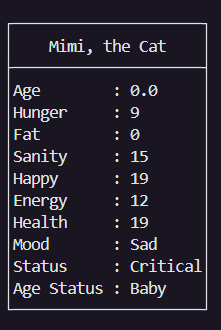

[English](README.md) | Indonesian | [中文](READMECN.md)
# 🐾 Game Peliharaan Virtual


Sebuah game simulasi peliharaan virtual berbasis konsol yang menawan, dibangun dengan Pemrograman Berbasis Objek (PBO) di Python. Pilih seekor peliharaan, berikan nama, dan ambil tanggung jawab untuk membesarkannya dari bayi mungil hingga menjadi sesepuh yang bijaksana. Kelola statistiknya, bermain dengannya, dan jaga agar ia tetap sehat dan bahagia!

---

## 🎮 Demo Gameplay

Seluruh permainan berjalan di terminal Anda, menampilkan kotak status yang detail dan seni ASCII yang menawan untuk setiap tahap kehidupan peliharaan.

**Buat peliharaan unik Anda sendiri:**
```
───────────────────────────────── Create Your Own Pet ─────────────────────────────────────────
Name your pet: Mochi
─────────────────────────────────────────────────────────────────────────────────────────────────
Here's five types of species you can choose:
1. Cat
2. Rabbit
3. Dinosaur
4. Dragon
5. Pou
─────────────────────────────────────────────────────────────────────────────────────────────────
Choose his/her species (input type of species here): cat

─────────────────────────────────────────────────────────────────────────────────────────────────
Mochi, a cat, has born!
─────────────────────────────────────────────────────────────────────────────────────────────────
```

**Saksikan ia tumbuh dan lihat seni uniknya di setiap tahap kehidupan:**
```
==================================================================================================

/|、      ......
(˚ˎ 。7  . miw! .
 |、˜〵   ......
じしˍ,)ノ
~~~~~~~~~~~~~~~

```

**Pantau kebutuhannya dengan panel status yang terperinci:**


---

## ✨ Fitur Utama

-   **Peliharaan Beragam & Berkembang**: Pilih dari 5 spesies unik: **Kucing, Kelinci, Dinosaurus, Naga, dan Pou**. Saksikan peliharaan Anda tumbuh melalui empat tahap kehidupan yang berbeda (Bayi, Remaja, Dewasa, Tua), masing-masing dengan seni ASCII yang dibuat dengan indah.
-   **Simulasi Peliharaan Mendalam**: Kelola serangkaian statistik yang kompleks termasuk **Rasa Lapar, Kewarasan, Kebahagiaan, Kesehatan, Lemak, dan Energi**. Setiap statistik memengaruhi suasana hati dan kesejahteraan peliharaan Anda. Mengabaikan kebutuhan mereka dapat menyebabkan kesehatan kritis!
-   **Sistem Perawatan Interaktif**: Berinteraksi dengan peliharaan Anda melalui berbagai tindakan:
    -   **Beri Makan**: Pilih dari menu makanan dengan efek yang berbeda.
    -   **Mandi**: Jaga kebersihan dan kewarasan peliharaan Anda dengan sabun yang berbeda.
    -   **Bermain**: Tingkatkan kebahagiaan dengan aktivitas khusus untuk setiap spesies.
    -   **Bicara**: Berinteraksi dengan peliharaan Anda untuk mendengar pikiran mereka atau bahkan mendapatkan lelucon!
    -   **Jalan-Jalan**: Ajak peliharaan Anda jalan-jalan, tapi waspadai kejadian acak yang bisa baik atau buruk!
    -   **Tidur**: Pulihkan energi peliharaan Anda.
-   **Ekonomi & Toko Dalam Game**: Dapatkan mata uang dalam game dengan bermain bersama peliharaan Anda. Habiskan di Toko Hewan untuk membeli berbagai makanan, sabun, dan ramuan kuat seperti "Pembakar Lemak" atau "Ramuan Dewasa".
-   **Autentikasi Pengguna**: Sistem pengguna yang aman memungkinkan pemain untuk mendaftar, masuk, dan mengubah kata sandi mereka, dengan aturan validasi untuk memastikan kredensial yang kuat.
-   **Sistem Waktu**: Game ini melacak waktu yang berlalu dengan jam dan penghitung hari dalam game, dan statistik peliharaan Anda akan berubah secara pasif seiring waktu, membutuhkan perawatan terus-menerus.

---

## 🛠️ Pameran Teknis

Proyek ini adalah demonstrasi praktis dari prinsip-prinsip utama Pemrograman Berbasis Objek:
-   **Pemrograman Berbasis Objek (PBO/OOP)**: Seluruh proyek dibangun di sekitar kelas seperti `VirtualPet`, `User`, `Game`, dan `Shop`, menciptakan struktur yang logis dan dapat diskalakan.
-   **Pewarisan (Inheritance) & Polimorfisme**: Setiap hewan (`Cat`, `Rabbit`, dll.) mewarisi dari kelas dasar `VirtualPet`. Mereka berbagi metode umum (`feed`, `bath`) tetapi memiliki properti unik (seperti makanan favorit) dan tampilan seni ASCII yang unik (polimorfisme).
-   **Metode Kelas & Properti**: Kelas `User` menggunakan `@classmethod` untuk registrasi/login dan `@property` untuk penanganan kata sandi dan mata uang yang aman.
-   **Enkapsulasi Data**: Atribut kunci dalam kelas seperti `User` dienkapsulasi untuk melindungi integritas data.
-   **Desain Modular**: Kode dipisahkan dengan bersih ke dalam file yang berbeda (`user.py`, `pet.py`, `game.py`, dll.), masing-masing dengan satu tanggung jawab, membuat proyek mudah dipelihara dan dipahami.

---

## 🏛️ Arsitektur & Diagram Kelas

Arsitektur game ini berpusat pada kelas dasar `VirtualPet`, dengan kelas-kelas hewan spesifik yang mewarisinya. Kelas `Main` mengatur alur permainan, memanfaatkan objek `User`, `Game`, dan `Shop` untuk mengelola pengalaman secara keseluruhan.


---

## 🚀 Cara Memulai

Tidak ada *library* khusus yang diperlukan untuk menjalankan game ini, hanya instalasi Python standar.

### Prasyarat
- Python 3.x

### Instalasi & Menjalankan
1.  *Clone* atau unduh repositori.
    ```bash
    git clone [https://github.com/Jess2Jes/Virtual-Pet-Game.git](https://github.com/Jess2Jes/Virtual-Pet-Game.git)
    cd Virtual-Pet-Game
    ```
2.  Jalankan file `main.py` dari terminal Anda.
    ```bash
    python main.py
    ```
3.  Ikuti petunjuk di layar untuk mendaftarkan pengguna dan mulai bermain!

---
## 📂 Struktur Proyek
- `main.py` – Titik masuk utama, menangani menu dan status game.
- `game.py` – Mengelola loop gameplay inti dan interaksi dengan peliharaan.
- `pet.py` – Mendefinisikan kelas dasar `VirtualPet`, statistik, dan logika inti.
- `animal.py` – Berisi subkelas hewan spesifik dengan seni ASCII unik mereka.
- `formatter.py` – Kelas utilitas untuk membuat UI kotak status yang terformat.
- `shop.py` – Berisi kelas `Shop`, katalog item, dan logika pembelian.
- `user.py` – Menangani registrasi pengguna, autentikasi, mata uang, dan kepemilikan peliharaan.

---
## 🗺️ Rencana Pengembangan

-   **Persistensi**: Menyimpan/memuat status game untuk pengguna dan peliharaan mereka (menggunakan JSON, pickle, atau database).
-   **Implementasi GUI**: Mengubah game menjadi antarmuka grafis menggunakan *library* seperti Tkinter atau PyQT.
-   **Konten Tambahan**: Menambahkan lebih banyak jenis hewan, item, dan kejadian acak.
-   **Game Mini**: Memperkenalkan game mini interaktif untuk mendapatkan mata uang dan meningkatkan statistik.
-   **Pengujian**: Menerapkan *unit test* untuk memastikan kualitas kode dan mencegah *bug*.

---
## 👥 Penulis & Kontributor

<table border="0" cellspacing="10" cellpadding="5">
  <tr>
    <td align="center" style="border: 1px solid #555; padding: 10px;">
      <a href="https://github.com/Jess2Jes">
        
      </a>
      <br/>
      <a href="https://github.com/Jess2Jes">Jess2Jes</a>
    </td>
    <td align="center" style="border: 1px solid #555; padding: 10px;">
      <a href="https://github.com/Dendroculus">
        
      </a>
      <br/>
      <a href="https://github.com/Dendroculus">Hans</a>
    </td>
    <td align="center" style="border: 1px solid #555; padding: 10px;">
      <a href="https://github.com/StevNard">
        
      </a>
      <br/>
      <a href="https://github.com/StevNard">StevNard</a>
    </td>
  </tr>
</table>